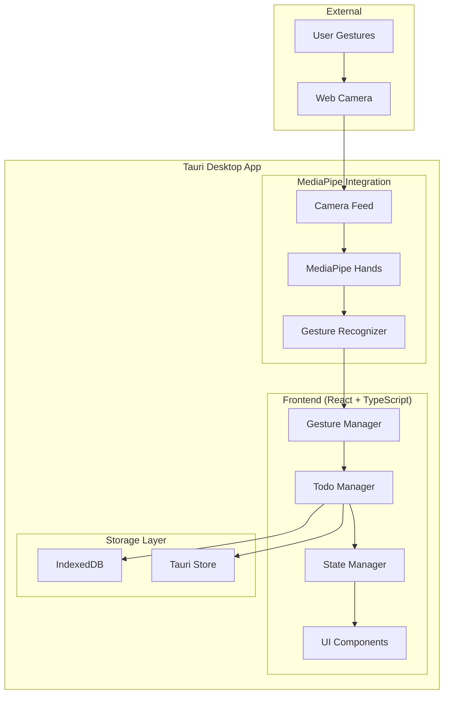

<!-- @format -->

# 設計文書

## 概要

MediaPipe Hands を使用した手のジェスチャー操作が可能な Todo アプリケーション。フロントエンドは React + TypeScript で構築し、Tauri を使用してデスクトップアプリケーションとしてパッケージ化する。MediaPipe Hands ライブラリを統合してリアルタイムの手の検出とジェスチャー認識を実現し、直感的なハンズフリー操作を提供する。

## アーキテクチャ

### 全体アーキテクチャ



### 技術スタック

- **フロントエンド**: React 18 + TypeScript + Vite
- **デスクトップ**: Tauri 1.x
- **ジェスチャー認識**: MediaPipe Hands (JavaScript 版)
- **状態管理**: React Context + useReducer
- **スタイリング**: Tailwind CSS
- **データ永続化**: IndexedDB + Tauri Store API
- **ビルドツール**: Vite + Tauri CLI

## コンポーネントとインターフェース

### 1. フロントエンドコンポーネント

#### App Component

- アプリケーションのルートコンポーネント
- 全体的な状態管理とプロバイダーの設定
- Tauri 初期化とカメラ権限の管理

#### TodoList Component

- タスクリストの表示と管理
- 選択状態の視覚的フィードバック
- 従来のマウス/キーボード操作のサポート

#### GestureCamera Component

- カメラフィードの表示
- MediaPipe Hands の初期化と管理
- 手の検出状況の視覚的フィードバック

#### TaskItem Component

- 個別タスクの表示
- 完了状態の視覚的表現
- 編集モードの切り替え

#### GestureIndicator Component

- 現在認識されているジェスチャーの表示
- ジェスチャーガイドの表示
- 操作フィードバックの提供

### 2. 状態管理インターフェース

```typescript
interface TodoState {
  tasks: Task[];
  selectedTaskIndex: number;
  isGestureMode: boolean;
  cameraStatus: "initializing" | "active" | "error" | "disabled";
  currentGesture: GestureType | null;
}

interface Task {
  id: string;
  text: string;
  completed: boolean;
  createdAt: Date;
  updatedAt: Date;
}

type GestureType =
  | "thumbs_up" // 新規タスク追加
  | "peace_sign" // タスク完了
  | "fist" // タスク削除
  | "point_up" // 上に移動
  | "two_fingers" // 下に移動
  | "open_palm" // キャンセル
  | "none";
```

### 3. ジェスチャー認識システム

#### GestureRecognizer Class

```typescript
class GestureRecognizer {
  private hands: Hands;
  private onGestureDetected: (gesture: GestureType) => void;

  constructor(onGestureDetected: (gesture: GestureType) => void);
  initialize(videoElement: HTMLVideoElement): Promise<void>;
  processFrame(): void;
  private classifyGesture(landmarks: NormalizedLandmark[]): GestureType;
  dispose(): void;
}
```

#### ジェスチャー分類ロジック

- 手のランドマーク座標を解析
- 指の位置関係から特定のジェスチャーを識別
- 信頼度スコアによるフィルタリング
- 連続フレームでの安定性チェック

## データモデル

### Task Model

```typescript
interface Task {
  id: string; // UUID
  text: string; // タスクの内容
  completed: boolean; // 完了状態
  createdAt: Date; // 作成日時
  updatedAt: Date; // 更新日時
}
```

### AppState Model

```typescript
interface AppState {
  tasks: Task[];
  selectedTaskIndex: number;
  isGestureMode: boolean;
  cameraPermission: "granted" | "denied" | "prompt";
  gestureSettings: {
    sensitivity: number;
    debounceTime: number;
    confidenceThreshold: number;
  };
}
```

### IndexedDB Schema

```typescript
// データベース名: 'GestureTodoApp'
// バージョン: 1

// Object Store: 'tasks'
interface TaskRecord {
  id: string; // Primary Key
  text: string;
  completed: boolean;
  createdAt: Date;
  updatedAt: Date;
}

// Object Store: 'settings'
interface SettingsRecord {
  key: string; // Primary Key
  value: any;
}

// 設定値の型定義
interface AppSettings {
  gestureEnabled: boolean;
  sensitivity: number;
  theme: "light" | "dark";
  confidenceThreshold: number;
  debounceTime: number;
}

// IndexedDB操作のインターフェース
interface TodoDatabase {
  addTask(task: Omit<Task, "id">): Promise<string>;
  updateTask(id: string, updates: Partial<Task>): Promise<void>;
  deleteTask(id: string): Promise<void>;
  getAllTasks(): Promise<Task[]>;
  getSetting<K extends keyof AppSettings>(key: K): Promise<AppSettings[K]>;
  setSetting<K extends keyof AppSettings>(
    key: K,
    value: AppSettings[K]
  ): Promise<void>;
}
```

## エラーハンドリング

### カメラアクセスエラー

- 権限拒否時の適切なフォールバック
- カメラ使用中エラーの検出と回復
- ユーザーフレンドリーなエラーメッセージ

### MediaPipe 初期化エラー

- ライブラリ読み込み失敗時の処理
- WebGL 非対応環境での代替手段
- パフォーマンス不足時の自動無効化

### ジェスチャー認識エラー

- 誤認識の最小化
- 認識失敗時のフィードバック
- 手動操作への自動切り替え

### データ永続化エラー

- IndexedDB 容量不足の処理
- データベーストランザクション失敗の処理
- Tauri Store API エラーの処理
- データ損失防止機構
- データベースバージョン管理とマイグレーション

## テスト戦略

### 1. ユニットテスト

- **対象**: 個別コンポーネント、ユーティリティ関数
- **ツール**: Jest + React Testing Library
- **カバレッジ**: ジェスチャー分類ロジック、状態管理、データ変換

### 2. 統合テスト

- **対象**: コンポーネント間の連携、MediaPipe 統合
- **ツール**: Jest + Testing Library
- **シナリオ**: ジェスチャー → アクション → 状態更新の流れ

### 3. E2E テスト

- **対象**: 完全なユーザーフロー
- **ツール**: Playwright (Tauri アプリ対応)
- **シナリオ**: アプリ起動 → カメラ初期化 → ジェスチャー操作 → データ永続化

### 4. パフォーマンステスト

- **対象**: MediaPipe 処理負荷、メモリ使用量
- **ツール**: Chrome DevTools、カスタムベンチマーク
- **指標**: フレームレート、CPU 使用率、メモリ消費

### 5. アクセシビリティテスト

- **対象**: キーボードナビゲーション、スクリーンリーダー対応
- **ツール**: axe-core、手動テスト
- **要件**: WCAG 2.1 AA 準拠

## セキュリティ考慮事項

### カメラアクセス

- 明示的な権限要求
- カメラデータの外部送信禁止
- ローカル処理のみでの完結

### データプライバシー

- 個人データの暗号化保存
- 不要なデータの自動削除
- ユーザー同意の明確化

### Tauri セキュリティ

- 最小権限の原則
- CSP（Content Security Policy）の設定
- 外部リソースアクセスの制限

## パフォーマンス最適化

### MediaPipe 最適化

- フレームレート調整（30fps→15fps）
- 検出領域の制限
- 不要な計算の削減

### React 最適化

- メモ化（React.memo、useMemo）
- 仮想化（大量タスク対応）
- 遅延読み込み

### Tauri 最適化

- バンドルサイズの最小化
- 起動時間の短縮
- メモリ使用量の最適化

## 国際化対応

### 多言語サポート

- 日本語、英語の対応
- react-i18next の使用
- 動的言語切り替え

### 地域設定

- 日付フォーマット
- 数値フォーマット
- 文字エンコーディング
